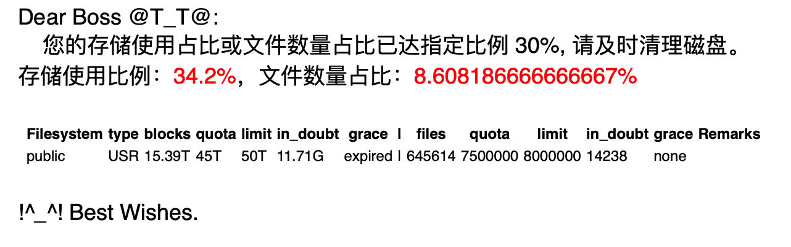

wlbdqm: Work Life Balance - Disk Quota Monitor
======================

> 定时执行 `diskquota` 命令，解析输出内容，计算存储占用比例及文件使用比例。若满足条件，则发送告警邮件。

### 安装

根据系统选择合适的执行文件，点击链接下载，并将文件拷贝或链接到 `$PATH` 其中目录即可。

* [Linux amd64](https://raw.githubusercontent.com/a2htray/wlbdqm/main/bin/wlbdqm_linux_amd64)
* [darwin amd64](https://raw.githubusercontent.com/a2htray/wlbdqm/main/bin/wlbdqm_darwin_amd64)

```bash
$ mv wlbdqm_linux_amd64 wlbdqm
$ ln -s /YOUR_PATH/wlbdqm /usr/local/bin/wlbdqm
```

### 选项

`wlbdqm` 支持以下选项：

```bash
Usage:
  wlbdqm [flags]

Flags:
  -D, --debug              used in debug mode
  -e, --env string         environment variables file
  -h, --help               help for wlbdqm
  -i, --interval string    time interval (default "12h")
  -p, --percentage float   exceeded percentage (default 80)
  -t, --to string          a target email address or list, use separator "|" (default "a2htray@outlook.com")
```

#### -D

`-D` 选项指定程序进入调试模式，程序输出包含调试信息：

```bash
$ wlbdqm -D -e ./.env -i 20s -p 80 -t a2htray@outlook.com
2021/10/30 01:40:35 [info]  run command `wlbdqm`
2021/10/30 01:40:35 [debug]  [[20s 20 s]]
2021/10/30 01:40:35 [debug]  interval 20s
2021/10/30 01:40:35 [info]  task 1 runs on @every 20s
```

#### -e

`-e` 选项指定环境变量文件，用于配置邮件服务器信息，环境变量文件如下：

```bash
WLBDQM_MAIL_FROM=YOUR EMAIL ADDRESS # 发件邮箱
WLBDQM_MAIL_PASSWORD=YOUR EMAIL PASSWORD # 邮箱密码
WLBDQM_MAIL_HOST=HOST DEPENDS ON EACH EMAIL SERVICE PROVIDER # 服务商 SMTP 地址
WLBDQM_MAIL_PORT=PORT DEPENDS ON EACH EMAIL SERVICE PROVIDER # 端口号
WLBDQM_DISKQUOTA_SCRIPT=YOUR DISKQUOTA SHELL SCRIPT # diskquota.sh 的绝对路径
```

`.env` 文件可下载仓库的 `example.env`，或自行创建。

#### -i

`-i` 选项指定执行 `diskquota` 命令的时间间隔，执行时间从命令执行之时开始计算。

* 支持整数输入
* 支持天（`d`）、时（`h`）、分（`m`）、秒（`s`）单位

```bash
-i 1d # 每天执行一次
-i 2h # 每两小时执行一次
-i 3m # 每 3 分钟执行一次
-i 4s # 每 4 秒执行一次
```

#### -p

`-p` 选项指定比例阈值。若存储占用比例或文件数量比例超过阈值，则程序将自动发送邮件。

#### -t

`-t` 选项指定邮件接收人。使用分隔符`|`设置多人接收。

```bash
-t foo@example.com
-t foo@example.com|bar@example.com
```

### 示例

启动程序

```bash
$ wlbdqm -e ./.env -i 12h -p 80 -t foo@example.com
```

或后台运行并将输出重定向到日志文件

```bash
$ nohup wlbdqm -e ./.env -i 12h -p 80 -t foo@example.com > wlbdqm.log 2>&1 &
```

停止程序

```bash
$ ps -ef | grep wlbdqm
501 75553 36966   0 12:58PM ttys001    0:00.01 wlbdqm -e ./.env -i 12h -p 80 -t foo@example.com
501 75802 36966   0 12:59PM ttys001    0:00.00 grep wlbdqm
$ kill -9 75553
```

### 其他

邮件截图

